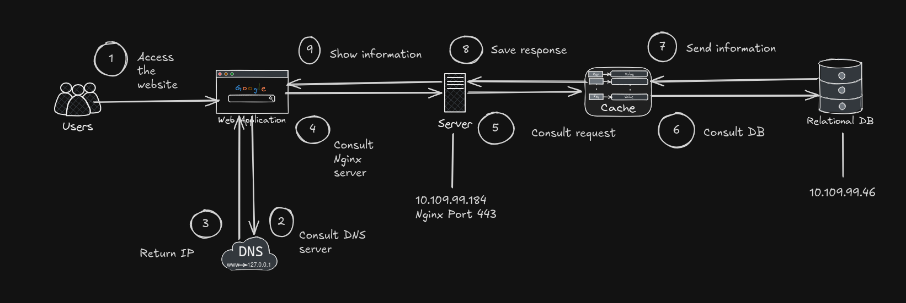
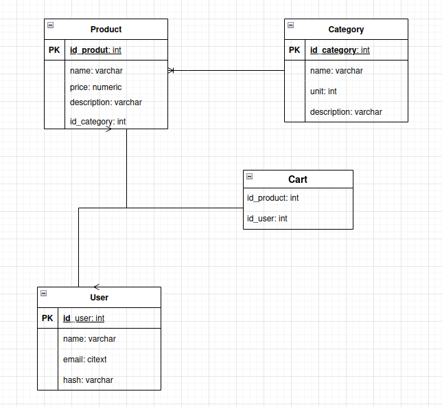

# Final Project 1ºDAW

# Table of contents
- [Day 1](#day-1)
    1. [Data source and functionality](#data-source)
    2. [Virtual machines](#virtual-machines)
    3. [Architecture diagram](#architecture-diagram)
    
- [Day 2](#day-2)
    1. [Postgres and PgAdmin setup](#db)
    2. [Entity Relationship Diagram](#entity-diagram)

- [Day 3](#day-3)
    1. [Nginx Configuration](#nginx)

## Day 1 <a name="day-1"></a>

## Data source and functionality <a name="data-source"></a>
We have chosen the Ebay API as our primary 
data source of information. We will use this API to retrieve
information related to products based in our interests.

Our plan is to use a lightweight Python Backend Framework, such as
Flask or FastApi and the library requests. 

We will use FastApi/Flask to declare endpoints that we will call from the Frontend to populate the database
and additionally generate an html page with the products information consolidated in the database.

The library requests will be used directly from the backend to retrieve the information related
to the selected products. We will then parse the JSON response and insert product info in the database.

Since we have decided to use an API to retrieve product data, we will be using the **requests** library in Python
for this purpose. At first we'll need to know how the API we want to hit is built (endpoints we can attack). If the 
API is public this is usually documented in detail.

Once we know at a high level the endpoints we need to attack and the http methods that will be used per endpoint (in this
case we'll be using the GET http method primarily since our main goal is to retrieve data, not to populate any) we can 
use the requests library to perform this actions.

A very basic example from the [docs](https://requests.readthedocs.io/en/latest/) to retrieve data from 
an API would be this:

```python
import requests
url = 'https://api.github.com/user'
# We will be using the .get method since we are just retrieving information
r = requests.get(url)
# We most probably will be dealing with JSON responses from the API
# so we'll need to decode the JSON somehow to work with the data we have retrieved.
# For that will be using the .json() method to work with the data sent from the API.
r.json()
```

The moment we have parsed the data recovered from the API we can make a connection with 
the Postgres database with the library **psycopg2** and make insertions with the data we have recovered
from the API.

To configure a secure HTTPS server, we will first install nginx  because it uses little memory and is an open-source web server. Then, we install cerbot being an automatic and free toll to enable HTTPS on websites using SSL/TLS certificates with the following command:

```python
sudo cerbot --nginx
```

For two-factor authentication, we will use Google Authenticator with the googleauth library in Python.

## Virtual machines <a name="virtual-machines"></a>
For this project, two VMs will be created: one will be the server (using nginx) and the other will host the PostgreSQL database. Each has the following requirements:
- VM BBDD Postgres:
    - 4 GB RAM
    - 50 GB Virtual disk
    - Bridge adapter
    - 10.109.99.46
    - User: postgres
- VM Servidor:
    - 4 GB RAM
    - 50 GB Virtual disk
    - Bridge adapter
    - 10.109.99.184
    - User: nginx

## Architecture diagram <a name="architecture-diagram"></a>



## Day 2 <a name="day-2">

## Setting up Postgres and PgAdmin <a name="db"></a>

For the development of this project we'll be using PostgreSQL to store data related to products, users and categories in our store and PgAdmin to establish the database connection with the purpose of running SQL scripts and administrating the database.

Since we have decided to containerize our application using Docker and divide the responsibilities we will be running PgAdmin as a container and exposing the port 5432 (which is usually the one that PostgreSQL uses) so PgAdmin can establish the connection.

Docker compose will help us connect PgAdmin to the PostGreSQL container, because when we specify several images under the same compose.yaml file, Docker creates internally a network, so all containers can communicate between them.

## Entity Relationship Diagram <a name="entity-diagram"></a>


## Day 3 <a name="day-3">

## Setting up Nginx Web Server <a name="nginx"></a>

Nginx will be the only container that will have port mapping in the main machine, since
it will act as the entrypoing of the application and it will be responsible for serving
the static files of our website. The api calls to the FastApi backend server will be done
hitting the same url but adding /api at the end of the URL. This way Nginx will redirect the traffic
to the fastapi container, so it can handle the api call and generate a response for the frontend to consume.

We have containerized our application, so we won't need to install Nginx
in a machine with a package manager. Instead we have written a Dockerfile
file in which we will specify:

    - The base image will be using for using Nginx
    - nginx.conf file
    - the static files that nginx will serve when a client makes a call to the url
    on port 80 since at this very moment we have not implemented https and we won't 
    be serving any content on port 443.

### Dockerfile 

```bash
# This image will be pulled from Docker Hub
# and already has Nginx installed
FROM nginx:stable-alpine3.23

COPY nginx.conf /etc/nginx/conf.d/default.conf
COPY static-site/ /usr/share/nginx/html/
```

With the Dockerfile that is shown above we will pull the Nginx image from 
Docker Hub(Repository of images) and having this image as our base, we will add
the necessary files to configure it.

With the **COPY** keyword inside Dockerfile we can copy content from our local file 
system to the container file system.

### Usage of nginx.conf

In this file we need to specify the content nginx is going to serve when the client
makes http calls on port 80 to the server serving Nginx. Since nginx is running on a container
we need to map a port on the machine that is going to run Docker to the container. We can achieve this
by declaring it on a docker-compose.yaml file. 

Additionaly since Nginx can also work as a proxy we can declare redirections based
on the path of the URL. For example: Now we have added a redirection to the fastapi container which will take care
of handling api calls made from the frontend. We could also make a redirection to the container running pgadmin
everytime the client hits the /admin path.

```bash
server {
    listen 80;

    # This is where our static files are stored
    # In the nginx container
    root /usr/share/nginx/html;
    index index.html;

    location / {
        try_files $uri $uri/ =404;
    }

    # This is done to redirect the api calls
    # made by the client to the fastapi container
    # running the backend server
    location /api {
	proxy_pass http://fastapi:8000;
        proxy_set_header X-Real-IP $remote_addr;
        proxy_set_header X-Forwarded-For $proxy_add_x_forwarded_for;
    }
}
```

## Loading product data from the Ebay API and storing it in PostgreSQL using a Cronjob.

We are going to automate the process of product data retrieval and the storage of
this data in PostgreSQL with a Cronjob. Cronjobs are used in Linux to run scripts 
at a specific period of time, in our case, we will specify to run a python script daily
at midnight. We are doing this to update our catalog of products daily and not show the same
products everyday. It's also possible that products can be acquired, making the products unavailable 
to get. So we think a daily refresh of products is a good choice.

We will have a separate container that will be reponsible of running our python script daily.
We will achieve this by specifying how often will the script run followed by the the command
it will run at that specific time. In our case it will run daily and it will run the script
located at /app/cronjob.py. This path is where the script resides INSIDE the container. This is declared
previously in the Dockerfile:

```bash
FROM python:3.12-slim

WORKDIR /app

RUN apt-get update && apt-get install -y \
    libpq-dev \
    gcc \
    build-essential \
    cron \
    && rm -rf /var/lib/apt/lists/*

COPY cronjob /etc/cron.d/cronjob

RUN chmod 0644 /etc/cron.d/cronjob

RUN touch /var/log/cron.log

COPY requirements.txt .

RUN pip install -r requirements.txt

COPY cronjob.py .
COPY entrypoint.sh .

RUN chmod +x /app/entrypoint.sh

CMD ["/app/entrypoint.sh"]
```

With WORKDIR we can establish the current working directory
and which will be /app in this case and with COPY as said previously
we can copy files that are located on the machine that's running 
docker to the container itself.

### Script responsible for data retrieval from the Ebay API and storage in the PostgreSQL database.

Since we are using PostgreSQL as our database we will be using the library **psycopg2** to establish 
a connection programatically from Python to the database. To retrieve data from the Ebay API we will be using
the **requests** library. But first, to be able to consume data from the Ebay API we need "credentials" or secrets
to have access to it. Without an api key or this secrets we won't be able to retrieve any kind of data from Ebay
at least from their API. This is done this way to implement rate limiting in APIs and limit the usage of it to users.

In Ebay they use a methodology to provide authorization called OAuth, this mechanism works by communicating to an 
authorization server with the "credentials" generated previously and then this server granting a token with limited time usage to communicate
with the Ebay API. This token is the one that will be passed in the authorization header of each http call to be able to perform data
retrieval successfully. Tokens have limited time usage for security measures in case a token gets stolen, damages will only be temporary.

In our cronjob.py script we have two classes, **Dbconnection** that will be responsible of establishing a connection to the PostgreSQL database
programmatically and then **Cronjob** that will be responsible.